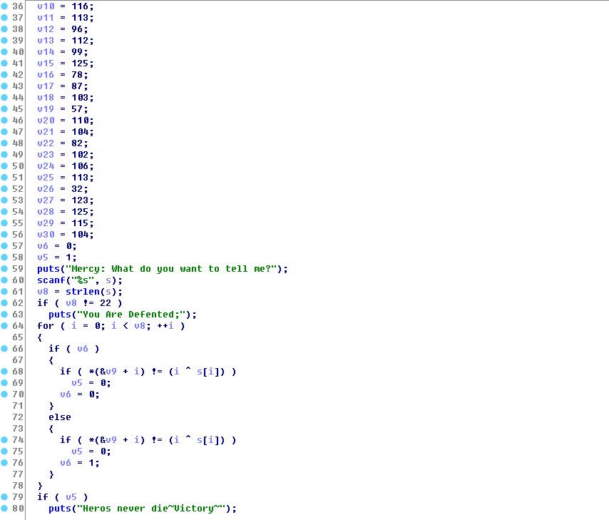

##  Title
EasyXor
##  Tools
IDA Pro v6.8

##  Steps

- Step 1
IDA打开，f5生成的伪C代码如下

- Step 2
简单分析一下，可以看到，读入字符串之后首先检查了字符串的长度是否22，之后开始逐位循环比较，看上去比较复杂，仔细分析之后可以看出对于v6的判断是没有任何意义的，仅仅是干扰一下逆向分析的过程。

下面就是分析flag加密检查过程，加密过程很简单，密文就是将明文逐位与它是第几位的位数进行异或，由于异或是可逆的，解密过程即为将密文与位数再次异或。

密文的ascii码即为上面一串奇怪的数字。

贴一下解算过程：
#!/usr/bin/python
cipher = [83, 116, 113, 96, 112, 99, 125, 78, 87, 103, 57, 110, 104, 82, 102, 106, 113, 32, 123, 125, 115, 104]
plaintext = ""
for i in range(0, 22):
    plaintext += chr(cipher[i] ^ i)
print plaintext